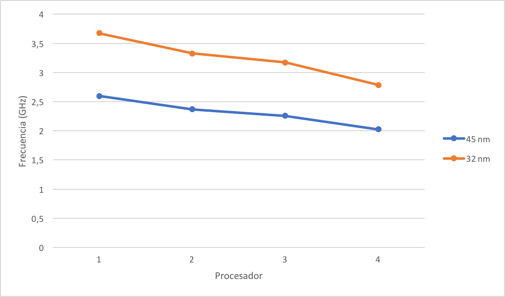
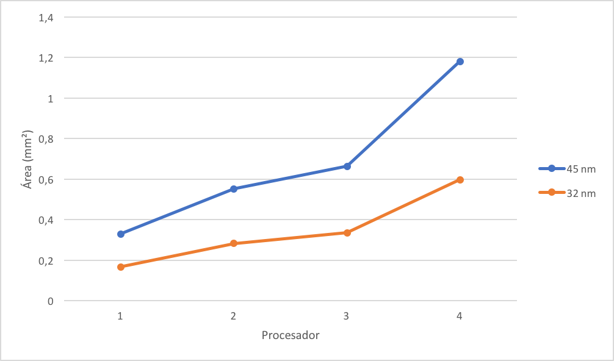
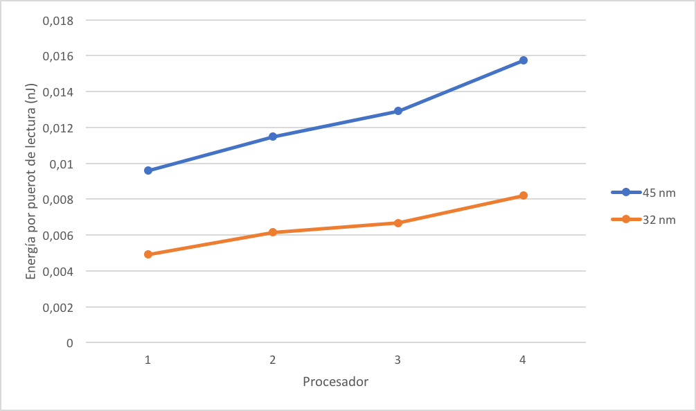
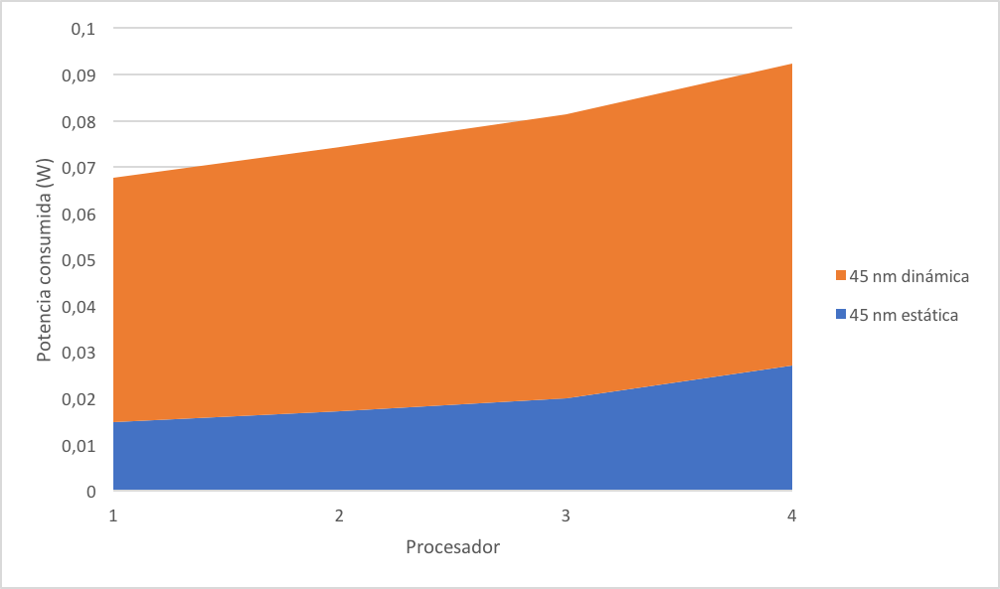
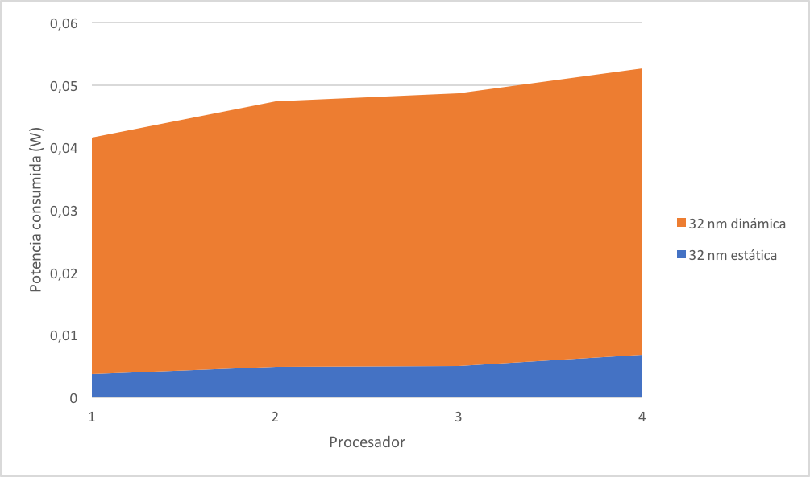

% Multiprocesadores  
  Ejercicio 3: Modelar con SRAM bancos de registros vectoriales y evaluarlos
% Barea López, Daniel
% 28-febrero-2017

### Tiempo dedicado (aproximado): 2.0 horas

## Resumen

Se trata de evaluar implementaciones del banco de registros vectorial basadas en memoria SRAM en chip multipuerto para cuatro procesadores diferentes. Para ello se usará la herramienta online Cacti [1][2].

Para cada procesador se pide:

* Calcular la frecuencia máxima, asumiendo que está determinada por el banco de registros y a partir de la latencia, con un 25% de margen.

* Realizar una gráfica de área y energía/acceso de 64 bits.

* Realizar una gráfica de la potencia total consumida, desglosada en dinámica + estática, asumiendo que la mitad de los ciclos de procesador se accede a todos los puertos.

* Repetir para el nodo tecnológico de 32 nm y comparar (optativo).

## Solución

### Frecuencia

La frecuencia se puede calcular a partir de la latencia con la siguiente fórmula:

$$
F = latencia^{-1}
$$

Para cada modelo, la frecuencia calculada es la siguiente:

 Modelo        Tecnología   Latencia (ns)   Frecuencia (GHz)
------------- ------------ --------------- ------------------
  4 puertos     45 nm        0.38482         2.59861
  7 puertos     45 nm        0.20065         2.36829
  8 puertos     45 nm        0.44331         2.25577
  11 puertos    45 nm        0.49402         2.02421
  4 puertos     32 nm        0.27201         3.67634
  7 puertos     32 nm        0.30048         3.32806
  8 puertos     32 nm        0.31518         3.17279
  11 puertos    32 nm        0.35885         2.78671

\ 

### Área

El área que ocupa cada modelo se encuentra representado en la siguiente gráfica:

\ 

### Energía

La energía que consume cada modelo se encuentra representada en la siguiente gráfica:

\ 

### Potencia

La potencia (estática y dinámica) consumida se encuentra representada en las siguientes gráficas:

\ 

\ 

## Referencias

[1] [Cacti](http://hpl.hp.com/research/cacti)

[2] [Cacti 5.3 rev 174 online](http://quid.hpl.hp.com:9081/cacti)
