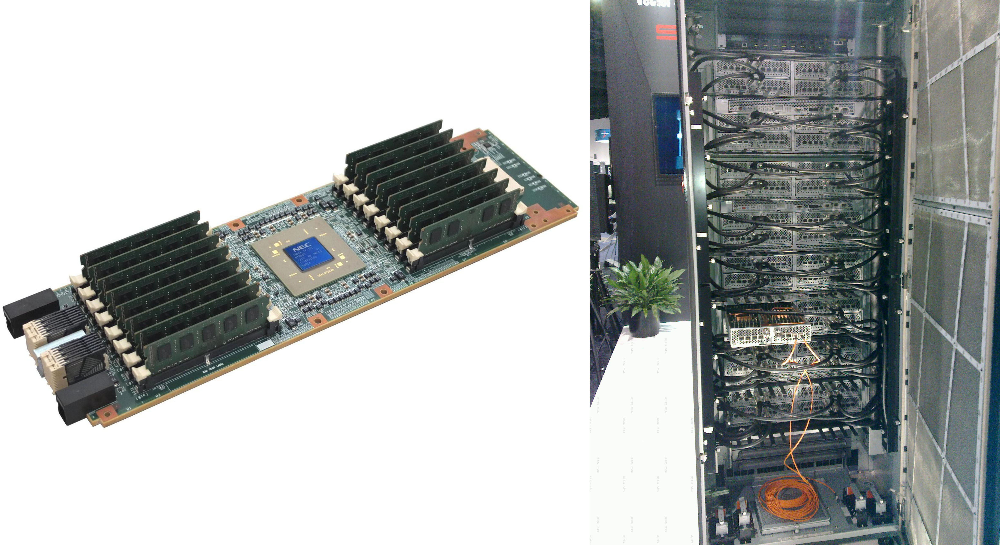

% Multiprocesadores  
  Ejercicio: Comparación entre el NEC SX-9 y el SX-ACE
% Barea López, Daniel
% 20-abril-2017

### Tiempo dedicado (aproximado): 6.0 horas

## Resumen

Se trata de comparar el NEC SX-ACE con el modelo anterior en lo referente a tecnología, organización, lenguaje máquina, configuraciones-escalabilidad, rendimiento y si es posible precio.

## Introducción

Los modelos SX-9 y SX-ACE son supercomputadores vectoriales de la marca NEC, introducidos en 2008 y 2013, respectivamente. Están destinados para su uso en aplicaciones específicas, como la meteorología.

Los computadores se componen de nodos, que cuentan con una CPU (con 1 o más núcleos) y su propia memoria (sistemas NUMA o SMP), conectados mediante una red de interconexión.

# Comparación de características y mejoras

Las características principales de cada uno se pueden encontrar en la siguiente tabla:

 Característica                           SX-9       SX-ACE
---------------------------------------  ---------- ------------
 Cores por CPU                            1          4
 CPUs por nodo                            16         1
 Nodos por armario                        1          64
 Rendimiento pico CPU (GFLOP/s)           102.4      256
 Memoria máxima por nodo                  1000 GB    64 GB
 Ancho de banda memoria por CPU (GB/s)    256        256
 Ancho de banda E/S por CPU (GB/s)        32         8
 Frecuencia CPU                           3.2 GHz    1 GHz
 Tamaño registros vectoriales             512 B      2 KB
 Número de registros vectoriales          72         72
 Tecnología de integración                65 nm      28 nm

La nueva generación apuesta por una tecnología de más densidad, con menos nodos y un consumo más reducido, así como el tamaño del superordenador (en un armario se pueden colocar hasta 4 veces más CPUs). Según NEC, el SX-ACE consume 10 veces menos de lo que consumiría un SX-9 equivalente, y ocupa 5 veces menos.

El nodo del SX-ACE es una tarjeta de 11x37 cm, con un consumo estimado de 469 W. Este contiene una CPU con 4 núcleos. Estos nodos se montan en armarios (hasta 64 nodos por armario):

\ 

Otras mejoras que se han realizado en el SX-ACE a nivel arquitectural son:

- Ejecución fuera de orden de instrucciones load/store

- Cortocircuitos mejorados para operaciones vectoriales encadenadas

- Menor latencia de memoria

## Arquitectura y conjunto de instrucciones

La CPU del SX-ACE cuenta con dos caches de 32 KB (instrucciones y datos) y un buffer de instrucciones de 8 KB. También tiene 128 registros escalares de 64 bits, y cuenta con dos unidades funcionales para operaciones vectoriales, otras dos para operacionesescalares y otras dos para instrucciones load/store.

Cada núcleo tiene una "cache de vectores", llamada *ADB* (Assignable Data Buffer), que se encuentra entre el núcleo y la memoria. La CPU tiene 16 canales DDR3, 2 canales PCIe x8 y un canal de entrada y otro de salida (*IXS*, Internode Crossbar Switch).

Es capaz de decodificar 4 instrucciones por ciclo (ejecución no escalar con predicción de saltos).

La longitud vectorial es de 256 elementos de 8 Bytes, que se pueden almacenar en 64 registros vectoriales (más otros 8 destinados a almacenar los vectores fuente/destino de operaciones aritmético-lógicas).

Se utiliza un repertorio de instrucciones RISC, con instrucciones especiales para acceso a memoria (arquitectura load/store).

## Precio

No hay ninguna referencia oficial al precio de estas máquinas, puesto que se encargan a medida para las compañías que se las pueden permitir, y los precios se negocian con los departamentos comerciales.

Basado en el precio de un sistema similar adquirido por el servicio meteorológico alemán, Michael Feldman, editor de la publicación *HPCWire*, hace una estimación del precio de un supercomputador NEC SX-9 de 839 TFLOPs en menos de 500 millones de dólares [4].

En otro artículo se menciona que el SX-9 que adquirió la universidad de Tohoku se ofrecía para su alquiler por al menos 26.000 USD al mes [5].

Sin embargo, el mayor coste de estas máquinas está en el mantenimiento. Se estima que el SX-ACE del centro de supercomputación japonés cuesta alrededor de 20 millones de yens (unos 20.0000 USD) al año de mantener [6].

## Referencias

[1] [Hardware Technology of the SX-9](http://www.nec.com/en/global/techrep/journal/g08/n04/pdf/080403.pdf)

[2] [NEC SX architecture](https://en.wikipedia.org/wiki/NEC_SX_architecture)

[3] [Overview of Vector Supercomputer SX-ACE and Its Applications](http://russianscdays.org/files/talks16/HKobayashi_RuSCDays16.pdf)

[4] [NEC Revisited](https://www.hpcwire.com/2007/11/30/nec_revisited/)

[5] [NEC gets first order for SX-9 supercomputer](https://www.arnnet.com.au/article/198938/nec_gets_first_order_sx-9_supercomputer/)

[6] [Production and decay of charmed baryons](https://agenda.infn.it/getFile.py/access?resId=0&materialId=slides&confId=12147)

[7] [Folleto de presentación del SX-ACE](http://de.nec.com/de_DE/en/documents/SX-ACE-brochure.pdf)

[8] [Folleto de presentación del SX-9](http://fr.nec.com/fr_FR/en/documents/255_e_sx9.pdf)

[9] [Imágenes NEC SX-ACE](http://rvf.su/sc13/ngvector/index.html)
