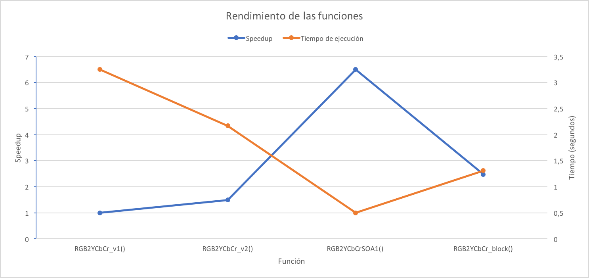

% Evaluación de la práctica 3: Vectorización aplicada a un problema real: procesado de imagen  
  30237 Multiprocesadores - Grado Ingeniería Informática  
  Esp. en Ingeniería de Computadores
% Jesús Alastruey Benedé y Víctor Viñals Yúfera  
  Área Arquitectura y Tecnología de Computadores  
  Universidad de Zaragoza
% 28-marzo-2017


## Resumen

Los tiempos y métricas deberán obtenerse para las máquinas del laboratorio L0.04, L1.02 o lab000.
Sed concisos en las respuestas. Se valorarán las referencias utilizadas._

## Notas generales

El trabajo puede presentarse de forma individual o en grupos de máximo dos personas.
Podéis trabajar en grupos mayores, pero **cada grupo debe elaborar el material a entregar de forma independiente**.
Hacedme llegar vuestros trabajos **en formato pdf** por correo electrónico.
Incluid vuestro nombre y apellidos en la cabecera del documento y vuestro NIP en el nombre del fichero (p3_NIP.pdf).  
**Plazo límite de entrega: miércoles 4 de abril, 23h59m59s.**

## Parte 1. Conversión de formato RGB a YCbCr

1.  **Lista el código fuente de la función `convertRGB2YCbCr_v2()` e**
    **indica los cambios respecto la función `convertRGB2YCbCr_v1()`.**

    ```c
        void
        convertRGB2YCbCr_v2(image_t * restrict image_in, image_t * restrict image_out)
        {
            double start_t, end_t, wall_dif;
            const int height = image_in->height;
            const int width =  image_in->width;
            float *tmpR = (float *) malloc(sizeof(float) * height * width);
            float *tmpG = (float *) malloc(sizeof(float) * height * width);
            float *tmpB = (float *) malloc(sizeof(float) * height * width);

            if (image_in->bytes_per_pixel != 3)
            {
                printf("ERROR: input image has to be RGB\n");
                exit(-1);
            }
            
            /* fill struct fields */
            image_out->width  = width;
            image_out->height = height;
            image_out->bytes_per_pixel = 3;
            image_out->color_space = JCS_YCbCr;

            start_t = get_wall_time();

            for (int it=0; it<NITER; it++)
            {
                /* Calcular píxeles */
                for (int i=0; i<height*width; i++)  // VECTORIZADO
                {
                    /* R */
                    tmpR[i] = RGB2YCbCr_offset[0] + 
                              RGB2YCbCr[0][0]*image_in->pixels[3*i + 0] + 
                              RGB2YCbCr[0][1]*image_in->pixels[3*i + 1] + 
                              RGB2YCbCr[0][2]*image_in->pixels[3*i + 2];
                    /* G */
                    tmpG[i] = RGB2YCbCr_offset[1] + 
                              RGB2YCbCr[1][0]*image_in->pixels[3*i + 0] + 
                              RGB2YCbCr[1][1]*image_in->pixels[3*i + 1] + 
                              RGB2YCbCr[1][2]*image_in->pixels[3*i + 2];
                    /* B */
                    tmpB[i] = RGB2YCbCr_offset[2] + 
                              RGB2YCbCr[2][0]*image_in->pixels[3*i + 0] + 
                              RGB2YCbCr[2][1]*image_in->pixels[3*i + 1] + 
                              RGB2YCbCr[2][2]*image_in->pixels[3*i + 2];
                }
                /* Combinar resultados en los píxeles de image_out */
                for (int i=0; i<height*width; i++)
                {
                    image_out->pixels[3*i + 0] = (unsigned char) tmpR[i];
                    image_out->pixels[3*i + 1] = (unsigned char) tmpG[i];
                    image_out->pixels[3*i + 2] = (unsigned char) tmpB[i];
                }
                dummy(image_in, image_out);
            }
            free(tmpR);
            free(tmpG);
            free(tmpB);

            end_t = get_wall_time(); wall_dif = end_t - start_t;
            results(wall_dif, height, width, "RGB2YCbCr_v2()");
        }
    ```

    Se han separado los cálculos de las componentes R, G y B en los vectores `tmpR`, `tmpG` y `tmpB`. Con esto se consigue que el compilador vectorice el bucle.

    Después se escriben en la imagen de salida los píxesles calculados con otro bucle, que el compilador no vectoriza.

    También se han añadido los modificadores `restrict` a los punteros a las imágenes de entrada y de salida, para indicar al compilador que se encuentran en rangos de memoria disjuntos.

2.  **Analiza el fichero que contiene el ensamblador y busca las instrucciones**
    **vectoriales correspondientes al bucle interno en `convertRGB2YCbCr_v2()`.**  
    **¿Cuántas instrucciones corresponden al cuerpo del bucle interno?**  
    **¿Cuántas de dichas instrucciones son vectoriales?**

    El bucle interno tiene **258** instrucciones, de las cuales **209** son **vectoriales**.

3.  **Calcula la aceleración obtenida respecto la la versión `convertRGB2YCbCr_v1()`.**

    $$
    speedup = \frac{t_{ex\,escalar}}{t_{ex\,vectorial}} = \frac{3.25}{2.17} = 1.498
    $$

4.  **(OPTATIVO) Si comparamos con detenimiento la imagen orginal y las generadas,**
    **se observan unas ligeras diferencias en la parte inferior derecha.**  
    **¿Cuál es el origen de dichas diferencias?**

## Parte 2. Transformación en la disposición de datos

1.  **Lista el código fuente de la función `convertRGB2YCbCr_SOA1()`.**

    ```c
        void
        convertRGB2YCbCr_SOA1(image_t * restrict image_in, image_t * restrict image_out)
        {
            double start_t, end_t, wall_dif;
            const int height = image_in->height;
            const int width =  image_in->width;
            unsigned char *Rpixels, *Gpixels, *Bpixels, *Ypixels, *Cbpixels, *Crpixels;

            if (image_in->bytes_per_pixel != 3)
            {
                printf("ERROR: input image has to be RGB\n");
                exit(-1);
            }
            
            /* fill struct fields */
            image_out->width  = width;
            image_out->height = height;
            image_out->bytes_per_pixel = 3;
            image_out->color_space = JCS_YCbCr;

            Rpixels = (unsigned char*) malloc(width*height);
            Gpixels = (unsigned char*) malloc(width*height);
            Bpixels = (unsigned char*) malloc(width*height);

            Ypixels = (unsigned char*) malloc(width*height);
            Cbpixels = (unsigned char*) malloc(width*height);
            Crpixels = (unsigned char*) malloc(width*height);

            /* transformación AoS -> SoA */
            for (int i=0; i<height*width; i++)     // VECTORIZADO
            {
                Rpixels[i] = image_in->pixels[3*i + 0];
                Gpixels[i] = image_in->pixels[3*i + 1];
                Bpixels[i] = image_in->pixels[3*i + 2];
            }

            start_t = get_wall_time();

            for (int it=0; it<NITER; it++)
            {
                for (int i=0; i<height*width; i++)  // VECTORIZADO CON PEELING
                {
                    /* R */
                    Ypixels[i] = (unsigned char) 
                        (RGB2YCbCr_offset[0] + 
                         RGB2YCbCr[0][0]*Rpixels[i] + 
                         RGB2YCbCr[0][1]*Gpixels[i] + 
                         RGB2YCbCr[0][2]*Bpixels[i]);
                    /* G */
                    Cbpixels[i] = (unsigned char) 
                        (RGB2YCbCr_offset[1] + 
                         RGB2YCbCr[1][0]*Rpixels[i] + 
                         RGB2YCbCr[1][1]*Gpixels[i] + 
                         RGB2YCbCr[1][2]*Bpixels[i]);
                    /* B */
                    Crpixels[i] = (unsigned char) 
                        (RGB2YCbCr_offset[2] + 
                         RGB2YCbCr[2][0]*Rpixels[i] + 
                         RGB2YCbCr[2][1]*Gpixels[i] + 
                         RGB2YCbCr[2][2]*Bpixels[i]);
                }
                dummy(image_in, image_out);
            }

            end_t = get_wall_time(); wall_dif = end_t - start_t;
            results(wall_dif, height, width, "RGB2YCbCrSOA1()");

            /* transformación SoA -> AoS */
            for (int i=0; i<height*width; i++)
            {
                image_out->pixels[3*i + 0] = Ypixels[i];
                image_out->pixels[3*i + 1] = Cbpixels[i];
                image_out->pixels[3*i + 2] = Crpixels[i];
            }
        }
    ```

2.  **(OPTATIVO) Analiza el fichero que contiene el ensamblador y busca las instrucciones**
    **vectoriales correspondientes al bucle interno en `convertRGB2YCbCr_SOA1()`.**
    **¿Cuántas instrucciones corresponden al cuerpo del bucle interno?**  
    **¿Cuántas de dichas instrucciones son vectoriales?**  

3.  **Lista el código fuente de la función `convertRGB2Gray_SOA_block()`.**

    ```c
        #define BLOCK 1024

        void
        convertRGB2YCbCr_block(image_t * image_in, image_t * image_out)
        {
            double start_t, end_t, wall_dif;
            const int height = image_in->height;
            const int width =  image_in->width;
            unsigned char Rpixels[BLOCK];
            unsigned char Gpixels[BLOCK];
            unsigned char Bpixels[BLOCK];
            unsigned char Ypixels[BLOCK];
            unsigned char Cbpixels[BLOCK];
            unsigned char Crpixels[BLOCK];

            if (image_in->bytes_per_pixel != 3)
            {
                printf("ERROR: input image has to be RGB\n");
                exit(-1);
            }
            
            /* fill struct fields */
            image_out->width  = width;
            image_out->height = height;
            image_out->bytes_per_pixel = 3;
            image_out->color_space = JCS_YCbCr;

            start_t = get_wall_time();

            for (int it=0; it<NITER; it++)
            {
                for (int i=0; i<3*height*width; i += 3*BLOCK)
                {
                    /* transformación AoS -> SoA */
                    for (int j=0; j<BLOCK; j++)     // VECTORIZADO
                    {
                        Rpixels[j] = image_in->pixels[i + 3*j + 0];
                        Gpixels[j] = image_in->pixels[i + 3*j + 1];
                        Bpixels[j] = image_in->pixels[i + 3*j + 2];
                    }
                    /* conversión RGB -> YbCrCb */
                    for (int j=0; j<BLOCK; j++)     // VECTORIZADO
                    {
                        /* R */
                        Ypixels[j] = (unsigned char) 
                            (RGB2YCbCr_offset[0] + 
                             RGB2YCbCr[0][0]*Rpixels[j] + 
                             RGB2YCbCr[0][1]*Gpixels[j] + 
                             RGB2YCbCr[0][2]*Bpixels[j]);
                        /* G */
                        Cbpixels[j] = (unsigned char) 
                            (RGB2YCbCr_offset[1] + 
                             RGB2YCbCr[1][0]*Rpixels[j] + 
                             RGB2YCbCr[1][1]*Gpixels[j] + 
                             RGB2YCbCr[1][2]*Bpixels[j]);
                        /* B */
                        Crpixels[j] = (unsigned char) 
                            (RGB2YCbCr_offset[2] + 
                             RGB2YCbCr[2][0]*Rpixels[j] + 
                             RGB2YCbCr[2][1]*Gpixels[j] + 
                             RGB2YCbCr[2][2]*Bpixels[j]);
                    }
                    /* transformación SoA -> AoS */
                    for (int j=0; j<BLOCK; j++)
                    {
                        image_out->pixels[i + 3*j + 0] = Ypixels[j];
                        image_out->pixels[i + 3*j + 1] = Cbpixels[j];
                        image_out->pixels[i + 3*j + 2] = Crpixels[j];
                    }
                }
                dummy(image_in, image_out);
            }

            end_t = get_wall_time(); wall_dif = end_t - start_t;
            results(wall_dif, height, width, "RGB2YCbCr_blk()");
        }
    ```

4.  **Compara el tiempo de ejecución de las funciones**
    - **`convertRGB2YCbCr_v2()`**
    - **`convertRGB2YCbCr_SOA1()`**
    - **`convertRGB2YCbCr_block()`**

    **Ten presente que el tiempo de ejecución de `convertRGB2YCbCr_SOA1()` no incluye**
    **la transformación de datos, mientras que el tiempo de ejecución de `convertRGB2YCbCr_block()`**
    **_sí_ lo hace.**

    La siguiente gráfica muestra el rendimiento del programa (speedup con respecto a versión escalar, tiempo de ejecución) para las distintas funciones (para `convertRGB2YCbCr_block()` se usa un tamaño de bloque de 1024 elementos):

    \ 

    Se observa que el rendimiento mejora con cada implementación del algoritmo. No se pueden tener en cuenta los resultados de la función `convertRGB2YCbCr_SOA1()`, puesto que no incluye el tiempo empleado en transformar las estructuras de datos, mientras que `convertRGB2YCbCr_block()` sí que lo incluye.

5.  **(OPTATIVO) Trata de reducir el tiempo de ejecución de `convertRGB2YCbCr_block()` cambiando el valor de `BLOCK`.**

    Se han realizado ejecuciones para tamaños de bloque desde 2 hasta 2048 elementos. El rendimiento mejora al aumentar el tamaño de bloque hasta 1024 elementos, a partir de entonces el programa produce una violación de segmento:

    \ 
