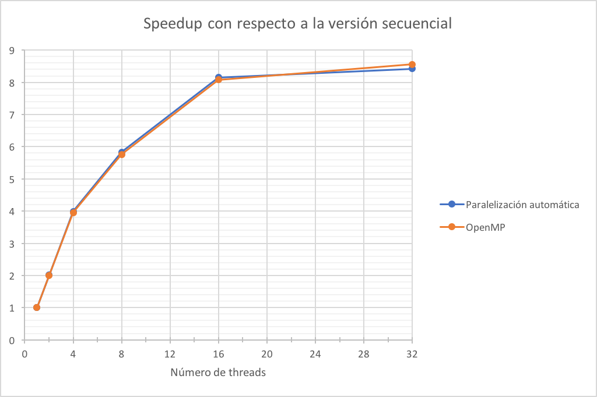
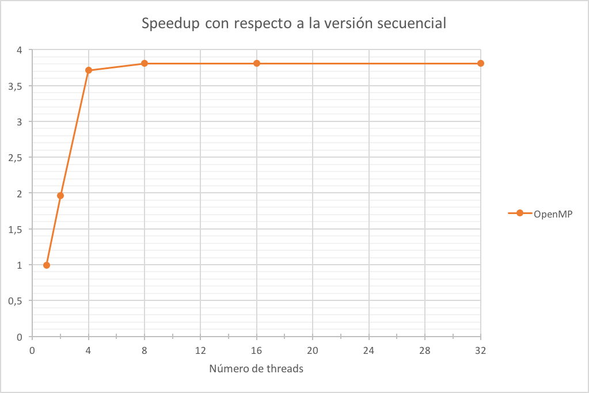

% Evaluación práctica 5: Paralelización automática y mediante directivas OpenMP  
  30237 Multiprocesadores - Grado Ingeniería Informática  
  Esp. en Ingeniería de Computadores
% Barea López, Daniel
% 5-mayo-2017


## Resumen

_Para la evaluación de la práctica 3 vais a resolver varias cuestiones relativas
a los puntos 4.1 y 4.2 del guión de prácticas.
Sed concisos en las respuestas._

## Notas generales

El trabajo puede presentarse de forma individual o en grupos de máximo dos personas.
Podéis trabajar en grupos mayores, pero **cada grupo debe elaborar el material a entregar de forma independiente**.
Hacedme llegar vuestros trabajos **en formato pdf** por correo electrónico.
Incluid vuestro nombre y apellidos en la cabecera del documento y vuestro NIP en el nombre del fichero (p5_NIP.pdf).  
**Plazo límite de entrega: viernes 12 de mayo, 23h59m59s.**


## 4. Ejecución paralela

### 4.1. Paralelización automática por parte del compilador

**Especifica las opciones de compilación necesarias para que**
**el bucle de cálculo del código `pi.f90` se paralelice de forma automática y**
**la salida del compilador muestre los bucles paralelizados.**

Para que el compilador de Sun paralelice de manera automática los bucles `DO`, es necesario añadir el flag `-autopar` a las opciones de compilación.

Sin embargo, como se puede observar en la salida del compilador (el flag `-loopinfo` muestra información acerca de qué bucles se han paralelizado), solamente con el flag `-autopar` no es capaz de paralelizar el código. Esto se debe a que existe una dependencia en la variable `area`, que se calcula sumando todos los valores generados.

Se puede resolver añadiendo un segundo flag, `-reduction`, que indica al compilador que realice las reducciones necesarias.

**Al respecto de los tiempos de ejecución observados (1, 2, 4, 8, 16 y 32 threads):**

- **¿Cuál es la diferencia entre los tiempos que devuelven las funciones `dtime()` y `etime()`?**

La función `dtime` devuelve el tiempo transcurrido desde la última llamada a esta función. Para entornos de un solo procesador, esto se traduce al tiempo usado por la CPU, mientras que en entornos multiprocesador sería la suma del tiempo de CPU usado por todos los procesadores.

La función `etime` devuelve el tiempo transcurrido desde el comienzo de la ejecución.

- **Calcula las aceleraciones (_speedups_) respecto a la ejecución de este código con 1 procesador.**

Hasta 16 hilos, el _speedup_ crece rápidamente, pero a partir de los 32 hilos deja de crecer, debido a la sobrecarga por la paralelización. El tiempo total de CPU usado por todos los procesadores, sí que sigue incrementándose linealmente, aunque el rendimiento no lo haga. Esto es importante tenerlo en cuenta en entornos donde se factura por el tiempo de CPU utilizado.

- **Trata de relacionar los _speedups_ con las características de `hendrix`.**

Hendrix cuenta con un microprocesador UltraSPARC T2 a 1.2 GHz con 4 núcleos, cada uno de los cuales puede ejecutar hasta 8 hilos (32 hilos simultáneos):

```
[a666156@hendrix01:~]$ # Número de CPUs
[a666156@hendrix01:~]$ psrinfo -p
1
[a666156@hendrix01:~]$ # Número de núcleos
[a666156@hendrix01:~]$ kstat cpu_info | grep core_id | sort -u | wc -l | awk -F' ' '{print $1}'
4
[a666156@hendrix01:~]$ # Número de hilos
[a666156@hendrix01:~]$ psrinfo -pv
The physical processor has 32 virtual processors (0-23 32-39)
  UltraSPARC-T2 (chipid 0, clock 1165 MHz)
```

<!-- end of list -->


### 4.2. Paralelización manual mediante directivas OpenMP

**Detalla las directivas OpenMP insertadas en el código `pi_omp.f90`**
**para especificar de forma manual el paralelismo existente en el bucle principal del programa.**

Se han añadido las directivas `PARALLEL DO` y `REDUCTION`:

```fortran
!$OMP PARALLEL DO REDUCTION(+:area)
DO i = 1,nsubintervals
    x = (i-0.5)*subinterval;
    area = area + 4.0/(1.0 + x*x);
ENDDO
!$OMP END PARALLEL DO
```
\newpage

**A partir de los tiempos de ejecución (1, 2, 4, 8, 16 y 32 threads),**
**calcula las aceleraciones (_speedups_) respecto a la ejecución de este código con 1 procesador.**

El código generado se comporta de manera casi idéntica al generado de manera automática por el compilador:

\ 

\newpage

## (Optativo) Cálculo de aceleraciones en otros sistemas

**Si tienes un procesador con varios núcleos puedes repetir la práctica con dicho sistema.**
**Para ello necesitarás un compilador que soporte las directivas OpenMP (`gcc`, `icc`).**

Se han ejecutado las pruebas sobre un procesador Intel Core i7-4770 con 4 núcleos a 3.40 GHz (HyperThreading, 2 threads/núcleo), corriendo OSX 10.11.6. El compilador utilizado ha sido GNU Fortran versión 6.3.0. El programa se ha ejecutado para 1000000000 subintervalos, en lugar de 100000000, para que el programa tarde más tiempo en completarse (x10).

La compilación se ha realizado con el flag `-fopenmp` y los tiempos se han medido con la utilidad `time` de Unix.

Los resultados son bastante diferentes a los obtenidos con el UltraSPARC; al poder ejecutar muchos menos hilos concurrentes, el _speedup_ se estabiliza a partir de 4 hilos (curiosamente, la ejecución con 8 hilos no obtiene prácticamente ninguna ventaja con respecto a 4):

\ 
